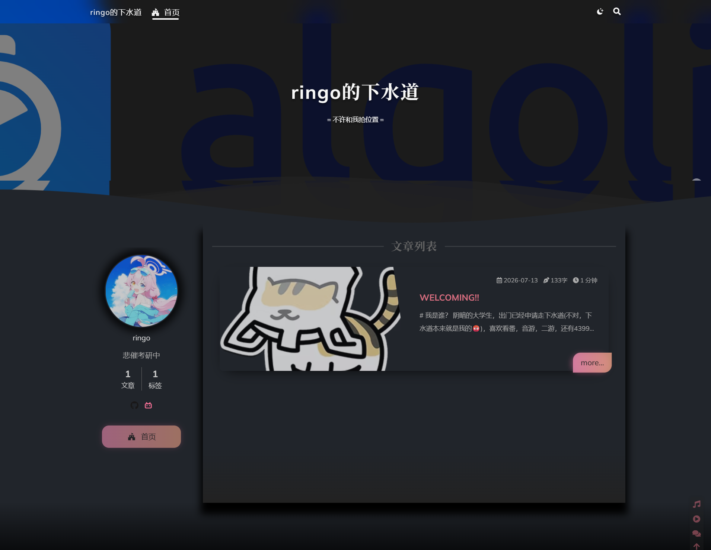

7/13/26  11PM

又是深夜啦，睡觉之前，总结一下今天干了什么吧。

早上背了一些单词，然后把1000题写了一点。

中午买了台云服务器，然后就一直在折腾这个玩意，最后几个小时后终于弄完啦，基于[ShokaX](https://github.com/theme-shoka-x/hexo-theme-shokaX/)，毕竟我是二次元嘛。最后的成果是这样的

感觉还看得过去吧，之后再慢慢优化，睡觉喽。哦对了对了，请访问这个http://47.104.189.4/，因为我还没用买域名，所以暂时只能IP访问啦。

以后的总结就是有什么有意义或者有意思的事情发生的时候写，不然就是每周末总结一次。
